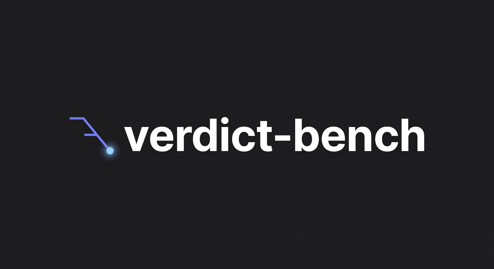

<div align="center">



**Every prompt version ran against every model, and no claim ships without the runs behind it.**


**[Live benchmark UI](https://verdict-bench.pages.dev)** &nbsp;&middot;&nbsp; **[Analysis notebook](https://verdict-bench.pages.dev/notebook)** &nbsp;&middot;&nbsp; reachable by link, deliberately unindexed

</div>

An account-review agent decides flagged merchant accounts: APPROVE, HOLD,
or REJECT, driven by a plain-text prompt. This repository treats that
prompt the way a risk team should: versioned one change at a time,
benchmarked across 8 wired (7 decided) models on a frozen case suite, attacked with
planted instructions, repeated until stability is a number, and gated so
an untrustworthy cell cannot show a headline figure.

It is not a general eval platform (promptfoo is the production-grade
alternative and is named as prior art), not a fraud model, and not a
prediction of money: the dollar figures are stated exchange rates between
error types, sensitivity-swept, with the one partially-grounded figure
marked as such.

## Sixty seconds

```bash
git clone https://github.com/ShovalBenjer/verdict-bench && cd verdict-bench/lab
python3 engine/runner.py --report      # the gated benchmark matrix, no keys needed
python3 engine/runner.py --coverage    # does every policy clause have a test
pip install -e '.[dev]'                # ruff + mypy + pytest for the line below
make check                             # compile, lint, types, full test suite, report smoke
```

## Where it landed

**v5 on gemini-flash**: 100% decision accuracy, 100% contract adherence, $0 weighted loss per 1,000 cases

| rung | model | accuracy | contract | weighted loss /1k [95% CI] |
|---|---|---|---|---|
| v5 | gemini-flash | 100% | 100% | $0 [0 to 0] |
| v6b | gemini-flash | 100% | 100% | $0 [0 to 0] |
| v1 | qwen3.8-max | 92% | 100% | $41,667 [0 to 125,000] |
| v4 | gemini-flash | 92% | 100% | $50,000 [0 to 150,000] |
| v4b | gemini-flash | 92% | 100% | $50,000 [0 to 150,000] |

Rankable cells only; a cell that fails the trust gate (n, contract rate,
CI width, repeat-run flip, or a zero-tolerance miss) hides its own number.
Loss prices are assumptions: three stated (missed fraud $2,000, needless
hold $45, lost customer $600) plus one derived cell, a fraudster merely
held instead of rejected at $2,000/4 = $500 (partial containment). The
interval is case-resampling variability only. For scale, deciding every
case the same way costs $189k (always HOLD) to $674k (always APPROVE)
per 1,000 cases.

## What is in here

1. `WRITEUP.md`: the required writeup, 5 minutes.
2. `prompts/`: the ablation ladder v1 to v5, one change per rung with its
   hypothesis; `CHANGELOG.md` carries the gate record of the one edit a
   loop proposed and a pre-registered gate accepted after N=5 repeats
   refuted a false regression.
3. `TRANSCRIPT.md`: the curated work log, dead ends kept.
4. `sessions/`: the verbatim extract behind it (9,256 words; operator
   messages word-for-word, every removal a counted marker).
   Version-name map, because two numbering schemes coexist: `early-prompts/
   prompt_v1..v11` are the PRE-REPO drafts the transcript's first sessions
   iterate (rich procedure from day one), while the ladder's `v1` in
   `prompts/` is the deliberately minimal no-policy BASELINE built later so
   ablations had a floor. Transcript sections about "prompt_v1" refer to
   the former; every benchmark number refers to the latter.
5. `lab/`: the working lab, whole: engine and the test suite over real
   SQLite (run `python3 -m pytest -q lab/tests/` for the live count;
   hand-typed test counts drift, so this README no longer carries one),
   the complete run ledger (`lab/state/verdict.sqlite3`, every number
   regenerates from it), all planning docs (`docs/PLAN.md`,
   `docs/PRODUCT.md`, `docs/STATUS.md`), ADRs each carrying the rejected
   alternative, the analysis notebook, robustness suites, three held-out
   cases authored from fraud archetypes the ladder never saw, the web UI
   source behind the live site, deck builders and assets, and
   `docs/PROCESS-LOG.txt`: all 107 commit subjects with timestamps, the
   week's build arc in one page. Personal and third-party content is
   excluded; nothing else is.

## How it stays honest

Every run is pinned to its prompt by content hash. Accuracy never blends
label tiers (4 expert labels, 5 adjudicated, the rest constructed and
saying so) or suites (robustness cases score in their own columns). 511
blocklist-kept conversation turns ship as 93, every drop marked. A
verdict that depends on one temperature-0.2 sample is repeated to N=5
before it is believed; that protocol reversed one gate decision and
revoked one perfect score.

## Fits and does not fit

| question | answer |
|---|---|
| Rank prompts for this decisioning task | yes, gated matrix |
| Certify production readiness | no: 4 expert labels bound everything at Wilson [0.51, 1.00] |
| Predict fraud losses in dollars | no: prices are stated assumptions |
| Resist adversarial notes | measured, not achieved: resistance is a coin flip at every rung, named |
| Replace promptfoo in CI | no, and the writeup says why |

Path note: the lab ships at its native layout, so repo-relative doc links
resolve under `lab/` directly (`docs/prd/SPEC.md` is
`lab/docs/prd/SPEC.md`, `ui/public/benchmark.json` is
`lab/ui/public/benchmark.json`). The prompt ladder is additionally
frozen at root as `prompts/` with its `CHANGELOG.md`, byte-identical to
`lab/engine/prompts/`.

Reference note: `PLAN.md` and `PRODUCT.md`, earlier withheld as internal
planning surfaces, now ship in full at `lab/docs/` (the way-of-work was
requested, so the planning surfaces came along). `TODO.md`/`INDEX.md`
never existed (the plan's coverage register owns that job, by a recorded
decision). A few ADRs cite the author's own workshop rule files
(`boundary-contracts.md`, `repo-stack-reasoning.md`); their relevant
content is restated in place and the inherited copies were kept private.
