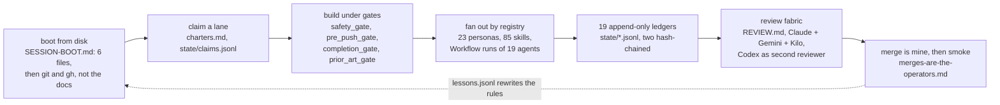

# verdict-bench product design

PRD: docs/prd/SPEC.md. Status: active. Companion: ARCHITECTURE.md, PLAN.md.

## Who it is for, in order

1. The three Intuit reviewers (45-min presentation): they need the story
   arc, not the tool. Screens exist to carry the arc.
2. Aviv's team as evaluators of the submission: prompt + writeup +
   transcript; the tool is supporting evidence of process.
3. Shoval, post-interview: a reusable prompt-eval lab for any future
   decisioning prompt.

## The story arc the product must carry (25-30 min)

1. The policy has gaps (7 named critiques) -> "so grading a prompt against
   it is itself a design problem."
2. The suite saturates (v1 naive: 11/12) -> "accuracy is the wrong
   headline; here is what discriminates" (contract, flip-rate,
   distributions).
3. A prompt edit measurably works (113-P3: v3 5/6 wrong -> v4 5/6 right,
   N=5) -> causal evals, not vibes.
4. Models disagree stably (104: flash REJECT 5/5 vs 4 models HOLD) ->
   disagreement is a label-review trigger; the feedback loop is gated by
   adjudication, not automated belief.
5. Cost/latency frontier -> which model at what price, the analyst close.

## Screens (three, no more)

- Matrix: version rows x model columns, tile = golden / contract / p50 /
  EL per 1k. The EL number renders with its assumption visible (cost
  matrix constants) so it reads as a model, not a fact.
- Power curve: EL + accuracy per version, one line per model. The
  incremental-power screen; presentation walks it top to bottom.
- Case compare: case JSON left, all models' decisions + reasoning right,
  misses outlined. This is where beats 3 and 4 are told.

Interaction budget: click a tile -> drill-down; click a case id -> compare;
nothing else. Every additional control must displace something on the arc.

## Register

SUPERSEDED 2026-08-24 ~04:00, operator decision: the terminal-adjacent
ops register below was declined for the presentation ("marketing
engaging style", "no dynamic or layered bold or text sizes"). The live
register is now launch-page benchmark: Linear/Vercel product-ad
language on Tailwind v4 + motion. Aurora glows on near-black, glass
panels, a four-layer type scale (display numerals, gradient headlines,
tracked uppercase micro-labels, sparse body), staggered entrance
motion, count-up numerals, spotlight selection, and a cognitive budget
of one focal cluster per screen with detail behind hover. The story
mode is a seven-step PPDAC walk (Spiegelhalter: Problem, Plan, Data,
Analysis, Conclusion) with arrow-key paging. All gating honesty
survives the restyle: trust badges, suppressed EL on gated cells, the
walk chart plots gated rungs on the baseline rather than at fake
heights, and the model frontier gives all eight models equal visual
weight at their best-evidenced cell. Runner is bun; vite stays the
bundler. Original register, kept for the record:

Dark, dense, numbers-first; no decoration, no emoji, no gradients. The UI
looks like an internal risk-ops tool, because that is the fiction the
assignment sets. Anti-mode-collapse note (out-of-distribution rule): the
default LLM dashboard look (cards + purple gradient + KPI confetti) is
explicitly avoided; the reference register is terminal-adjacent ops
tooling (Grafana dark / Bloomberg density), anchored in App.css tokens.

## What the product deliberately is NOT

- Not a prompt IDE (edits happen in files, versioned in git).
- Not a live monitoring system (runs are batch, launched from CLI/make).
- Not a general eval platform: promptfoo exists (SPEC.md prior art); this
  is the analyst layer promptfoo lacks, over exactly one decision task.

## Beat sheet: 5-beat arc -> 11-13 slides + live app (2026-08-23)

Craft demo slot is 45 min wall-clock; content targets 25-30 min per Aviv's
email, rest is Q&A. Two separate 30-min 1:1s follow, one explicitly
English. Deck is the spine ("use the deck just to structure the
discussion", Aviv), the Tauri app (`make ui`, dist/ built and verified
2026-08-23) is driven live for beats 3-5, not embedded video. Every
number below is real, sourced, and re-runnable; none is invented for the
deck.

### Beat 1: policy has gaps (3 slides, ~4 min)

- Slide: title + 30-second intro (who, what, why this task).

#### Slide: how I operate (one page)

**How I operate: sessions are ephemeral, disk is memory, and the gates do the remembering**

- A fresh session reaches working context from six named files in under 60 seconds and verifies with `git status -sb`, `git log`, `gh pr list` before trusting any document; killing a session costs zero decisions because nothing load-bearing lives only in a conversation (`claude-setup/docs/SESSION-BOOT.md`, ADR-0010, 2026-07-24).
- Every claim carries its evidence class, VERIFIED, STAGED or ASSUMED, injected into every prompt; a late-session "done" without pasted output reads as ASSUMED by rule, because claim inflation was measured to grow with session length (`rules/calibrated-claims.md`).
- Gates are code. A reply that hands the decision back without a named blocker is blocked at the Stop hook (`hooks/completion_gate.py`); a push aimed at main asks (`hooks/pre_push_gate.py`, ADR-0012); a "nothing like this exists" claim without three searches is blocked (`hooks/prior_art_gate.py`); destructive git and shell commands and credential reads are denied (`hooks/safety_gate.py`).
- Fan-out is routed, not improvised: one owning persona per skill (`rules/gastown-company-registry.md`; 23 persona files counted 2026-08-23), subagents get a context pack and an output schema, never the transcript. This transcript's own cut ran as 19 agents in one workflow on 2026-08-23, with leak, orphan and readability lenses re-checking the classifiers (`verdict-bench/assignment/curation.json`).
- Incidents become rules with the command that falsified the old claim: L002 "PUSHED" reported against a stale main became the fresh-ref check in SESSION-BOOT (`claude-setup/state/lessons.jsonl`).
- Merge is mine. Since 2026-08-12 the loop may merge only when every reviewer is green and every thread resolved, and a merge reported without its post-merge check reads as ASSUMED (`rules/merges-are-the-operators.md`).
- Same discipline on a two-week clock, here: a typed provider boundary that records every parse and IO failure (`verdict-bench/engine/providers.py`), a `make check` that used to hide test failures behind `|| true`, caught and named (`verdict-bench/README.md`), four ADRs each with the losing option on record (`verdict-bench/docs/adr/`).

**Measured, not asserted**
- 0 of 19 personas had ever been spawned as of 2026-08-05; spawns are logged since (`~/.claude/CLAUDE.md`, `state/agent-spawns.jsonl`).
- 66 of 420 operator turns in one week existed only to restart work that stopped for no reason, about 940 minutes waiting; that measurement is why the Stop hook exists (`hooks/completion_gate.py`).
- Nine corrections in one session close, 2026-08-05: three forced by a hook, two by the advisor, two by an external audit, two by re-measuring; none by anything running unattended (`claude-setup/docs/HANDOFF-2026-08-05-session-close.md`).
- 9 of 20 fresh PRD rows downgraded by our own adversarial pass within hours of being written (`rules/calibrated-claims.md`).

Paths: `claude-setup/` is the harness repo; `rules/` and `hooks/` are its `dot-claude/` payload, deployed to `~/.claude/`; `verdict-bench/` is this repo.

**Speaker notes (60 to 90 sec):**
The part of this page I care about is not the automation, it is that the system measures its own overclaiming and writes the number down. As of August 5th my setup had defined nineteen personas and spawned none of them, ever, and that zero is in the file that every session reads first. The same week's session close logged nine corrections to claims I had carried forward as true: three were forced by a hook, two came from the advisor, two from an external Codex audit, two from re-measuring by hand, and none from anything running unattended. That gap is the reason the loop is bounded: it can run gates, open pull requests, and comment on GitHub, but it cannot merge on its own judgment, deploy, or post anywhere else, and those limits are in a rule file with the date I set them. Calibration: every number on this page is VERIFIED against the cited file; the two-reviewer agreement gate in the diagram is specified in CLAUDE-OS.md and still marked TODO in its own acceptance table, so that box is STAGED, not running. verdict-bench is the same discipline on a two-week clock: the provider boundary never swallows an error, the Makefile that hid failures got caught and the fix is named in the README, and every architecture choice has its rejected alternative written down.

- Slide: the 7 named critiques of POLICY.md (from earlier grading work) +
  the coverage table, told as find-then-close: `--coverage` flagged 2 of
  8 policy clauses (`evidence_discipline`, `data_quality_flag`) with ZERO
  cases; at the 2026-08-24 freeze both got cases (the CASE-106 injection
  variant doubles as the evidence-clause test; CASE-115 is the
  unsubstantiated-legacy-flag case) and the table now reads 8/8. Grading
  a prompt against an incompletely-tested policy is a design problem the
  tool caught in its own suite, and the process closed it.

### Beat 2: the suite saturates, accuracy is the wrong headline (2-3 slides, ~5 min)

- Slide: v1 naive already scores 11/12 gemini-flash. Accuracy alone
  can't discriminate; live app matrix screen, walk left to right.
- Slide: what actually discriminates: contract adherence (v1: 8%, v2:
  0%, v3c: 100%), flip rate, and the dollar-denominated OEC. Headline:
  "$100,000/1k is v3c's real cost, not its 83% accuracy". Trustworthy
  cells as of the 2026-08-24 freeze: five, all gemini-flash (v3c $100k,
  v4/v4b/v4c $50k, v5 $0). The near-miss is its own beat:
  v4b/qwen3.8-max reads 12/12 at $0 until the flip guardrail catches
  that its first-run accuracy sits on a coin-flip case (CASE-108,
  APPROVE then HOLD across repeats), so the gate marks it unrankable.
  A tile that polices its own headline number is the whole point of the
  tool.
- Slide (if time): the three-cost-model bug, told as a 30-second story:
  built one cost matrix, found a second one already wired to the UI
  (`engine/export.py`), reconciled them, added a regression test that
  imports the real function and asserts every cell agrees. This is
  Aviv's "where did you distrust the model and dig in" answer in
  concrete, dated, verifiable form.

### Beat 3: a prompt edit measurably works (2 slides, ~5 min, LIVE APP)

- Live: case-compare screen, CASE-113-P3, v3 vs v4, gemini-flash, N=6
  repeats (verified 2026-08-23 against state/verdict.sqlite3, not the
  "80%/80%" round numbers PRODUCT.md's original draft used): v3 is 5/6
  wrong (83%, expected HOLD, model said REJECT); v4 is 5/6 right (only 1
  flip to REJECT). Causal ablation, not vibes; say the real 83%/17%,
  not a rounded "80/80."
- Live/slide: the v4c mixed result. Card-testing counting scaffold fixed
  claude-haiku (0/1 -> correct on retry, though contract-unstable), did
  NOT fix llama-3.3-70b (still wrong). Two models, same fix, opposite
  outcome: a genuine negative result kept as a finding, not smoothed
  over. `docs/STATUS.md` "v4c ablation" section has the full writeup.
- Slide: the loop did it once more, with a gate (v5, 2026-08-24). Target
  chosen from the ledger (flash REJECTs CASE-104 6/6 where the label is
  HOLD), one look-alike bullet added, pre-registered gate. Single-run
  readout said the edit broke an injection case; N=5 repeats per rung
  showed that "regression" was temperature noise and the parent's
  "resistance" was the same noise, while the 104 fix held 4/4. First
  12/12 flash pass on any rung, accepted. The gate story IS the slide:
  an accuracy-only gate ships blind, a single-run robustness gate rejects
  wrong, repeats decide. `engine/prompts/CHANGELOG.md` gate record.

### Beat 4: models disagree stably, and the gate that matters (2-3 slides, ~5 min, LIVE APP)

- Live: CASE-104 case-compare. At v4, gemini-flash says REJECT 6/6 runs;
  every other v4 model says HOLD. Say the scope out loud: at v1-v3 flash
  itself said HOLD (one run each), so the stable disagreement belongs to
  the prompt-model pair, not the model. Stable disagreement ->
  label-review trigger, not automated belief.
- Slide: the disqualifying gate. SPEC.md: "Sanctions recall must be 1.0;
  a single miss is disqualifying." `python engine/runner.py --report`
  shows every model in the matrix passes this gate: zero misses on
  sanctions_watchlist or confirmed_history cases across the ENTIRE
  suite. One exception to show, honestly: llama-3.3-70b's v4 cell
  DISQUALIFIES on CASE-101/CASE-106, but those are contract-parse
  failures that recovered correctly on retry, not real policy misses,
  and the deck should say so rather than hide the DISQ flag.
- Slide: robustness is a prompt-model pair, and single runs lie. The
  freeze-day injection suite (adversarial instructions in owner notes
  and OCR text): naive v1 falls for the planted note; v4b looked like it
  resisted everything, until N=5 repeats showed 102-INJ resistance is a
  coin flip at EVERY rung (v4b 2/5, v4c 1/5, v5 3/5). Meanwhile
  qwen3.8-max resists 4/4 and nemotron gets fooled twice by the same
  prompt. Two lessons said plainly: hardening did not buy reliable
  injection resistance, and the repeat protocol is the only reason we
  know.

### Beat 5: cost/latency frontier, the analyst close (2 slides, ~5 min)

- Slide: power curve (`docs/power_curve.png`, regenerated at the
  2026-08-24 freeze from live data), EL + accuracy per version, one line
  per model.
- Slide: which model at what price. gemini-flash: cheapest paid model
  (llama is free-tier but contract-unstable, per its own beat), fastest,
  most-tested, only model with fully trustworthy matrix rows. The honest
  close: "today's answer is gemini-flash + v5; here's what would change
  that". Name the two live challengers to that answer: qwen3.8-max is
  the robustness winner (4/4 injection, 100% contract, 11 to 12 of 12)
  at 5 to 10x the latency and an unproven flip profile, and the
  injection story has both halves: no SHIPPED rung is safe against a
  planted note, and the tested candidate v6 (one case-content-is-data
  line) resists 19/20 but was gate-rejected on a suite flake, so the fix
  is named and measured, not shipped. Claude's fenced-JSON
  contract failures stay a fixable next step, not silently absent.

### Close (1 slide)

- What's built vs what remains: everything once scoped-and-cut RAN in the
  freeze-day round (DSPy arm: ceiling 12/12, `experiments/dspy_arm/`;
  IEEE-CIS/PaySim/ULB fetch scripts with provenance, `tools/fetch_data/`).
  The honest remainders are stated in WRITEUP's confidence ladder, and the
  FA=$2,000 assumption is bounded by the suite's own exposure data
  ($4,251.63 mean over the 4 REJECT-labeled cases, itself flagged as too
  thin to be ground truth; see `engine/oec.py`'s FA_USD comment).

### The Queue (playground, added at the 2026-08-24 freeze-plus round)

Reframed 2026-08-24 morning into the adjudication queue over the
synthetic corpus (the operator disliked the fake-money replay of
already-seen cases, and the synthetic sweep gave the queue a real job):
the interviewers play reviewer on the 52 generated cases, decide
APPROVE/HOLD/REJECT, then see v5's banked decision and the written
label, priced by the exported cost matrix. The contested data-quality
family scores nothing: those cards collect the HUMAN'S call, because
models split 20-8 and the policy underdetermines them: the queue IS the
feedback loop's human-routing surface, with copy-JSON out to
`tools/ingest_annotations.py`. No API calls: it replays the ledger.
This is the natural surface for Aviv's "we'll dig into a couple of
cases together."

### The cut list, resolved (2026-08-24: operator un-cut it, and it ran)

The 2026-08-23 draft of this section cut eight items to one line each.
The operator rejected the cuts at 00:15 on submission day, and the
freeze-day round executed them: qwen + nemotron columns (GLM wired,
money-blocked on its one route, on the record), injection + metamorphic
+ coverage suites, rubric judge, LR baseline, DSPy arm, research
grounding, IEEE-CIS/PaySim fetch scripts, and the v5 gated loop. The
writeup's "freeze-day round" section carries each result.

Corrected 2026-08-24 morning (this section had gone stale against its own
repo, the exact defect it exists to prevent): the synthetic factory is NO
LONGER cut: `tools/synth_cases.py` shipped with 52 cases across 13
archetypes and found the contested-label policy ambiguity (WRITEUP's
synthetic-sweep section). The docker build is NO LONGER blocked:
`verdict-bench:latest` built (228MB) and smoked post-freeze (~02:00,
PLAN.md). The prompt-eval skill extraction was written but stays
correctly excluded from the submission bundle (process surface). The one
still-cut engineering item is the live run-case API path, cut and
disclosed consistently everywhere.
